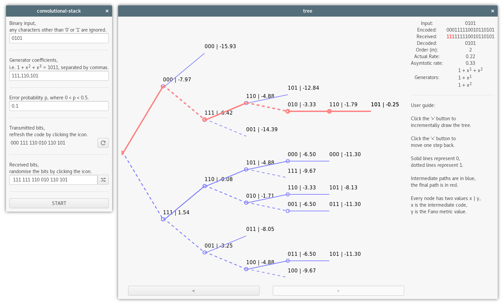

# convolutional-stack
Visualisation of the stack decoding algorithm used for convolutional codes.

# Screenshot

# Install on Linux
* `gtk-rs` is used, install the [requirements](http://gtk-rs.org/docs/requirements.html), on Fedora that is `sudo dnf install gtk3-devel glib2-devel`.
* Use `cargo` to build and run.

# Install on Windows
* Use [MSYS2](https://msys2.github.io/) to install GTK3: `pacman -S base-devel mingw-w64-x86_64-toolchain mingw-w64-x86_64-gtk3`, consider using `--force` on the `/mingw64 exists in filesystem` error. 
* Help `pkg-config` find the files that we just installed: `export PKG_CONFIG_PATH=/mingw64/lib/pkgconfig:$PKG_CONFIG_PATH`.
* Build the project: `cargo build`. Try to install `gcc` or `mingw-w64-x86_64-gcc` if there are any errors at this step.
* `cargo run` won't work at this point because it can't find the DLLs like `libgtk-3-0.dll`, those are in `/mingw64/bin` (very strange). Updating `LD_LIBRARY_PATH` does not seem to work, so a temporary workaround would be copy everything under `/mingw64/bin` to the same directory as the executable, e.g. `$project_dir/target/debug/convolutional-stack.exe`.
